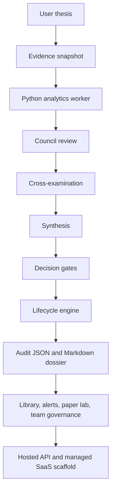

# Parallax

> A governed trading thesis analysis agent for research, paper trading, team review, and productized investment-research workflows.

Parallax helps analysts turn a market idea into a falsifiable, evidence-backed thesis dossier. It does not try to be a magic trading bot. It takes a specific trading or investment thesis, gathers a frozen evidence snapshot, runs deterministic analytics, sends the thesis through a council of specialized reviewers, challenges the result, applies hard product and risk gates, and produces a human-readable decision package with audit artifacts.

The operating principle is simple:

> Make unsupported conviction hard to hide.

Parallax is built with TypeScript and Python. TypeScript owns the agent orchestration, CLI, governance, SaaS scaffolding, hosted API, and product boundaries. Python owns numerical market analytics such as returns, volatility, drawdown, liquidity checks, transaction-cost proxies, dependency correlation, and portfolio exposure checks.

## Safety Notice

Parallax is research software. It is not investment advice, not a registered adviser, not a broker, and not a live trading system.

The current product ceiling intentionally stops below live execution. Parallax can produce research dossiers, watchlist candidates, paper-trade candidates, governance packages, partner-control records, and sandbox outputs. It should not be connected to a production brokerage or used to place real trades without separate legal, compliance, market-access, and human-approval systems.

## What Parallax Does

Parallax answers a narrower and more useful question than "Should I buy this?"

It asks:

> Is this specific thesis, at this specific time, with this evidence and this portfolio context, still justified?

For each thesis, Parallax can:

- build a structured thesis input from CLI arguments or fixture data;
- load local market, event, and portfolio evidence;
- run Python analytics over that evidence;
- ask deterministic or scripted LLM-style council personas to review the thesis;
- force the bull case and bear case to confront the same evidence;
- detect unsupported claims, stale evidence, risk problems, and restricted escalation;
- produce a decision class such as `no_trade`, `research_needed`, `watchlist`, or `paper_trade_candidate`;
- write immutable audit JSON and Markdown reports;
- monitor the thesis after creation with lifecycle triggers and alerts;
- simulate paper trades and post-trade reviews;
- support team review, comments, assignments, approvals, and governance exports;
- scaffold a managed SaaS control plane with tenant isolation, identity, storage, invite onboarding, account self-service, hosted setup repair, and provider boundaries.

## Why A Thesis Council Works When Markets Change

Markets change constantly, so Parallax does not treat a thesis as permanent truth.

Every dossier is time-bounded. The system freezes the evidence used at analysis time, attaches freshness metadata, adds invalidation triggers, and can later re-check the thesis against new prices, volatility, events, and portfolio context. The council does not say "this is true forever." It says "given this snapshot, here is the strongest supported interpretation, here is what would break it, and here is what must be watched next."

That design makes Parallax closer to an operating discipline than a prediction machine:

- the thesis must be explicit;
- the evidence must be inspectable;
- the council must show disagreement;
- the action must pass product and risk gates;
- the lifecycle engine must know when to re-check, escalate, or retire the thesis.

## Core Concepts

### Trade Thesis Dossier

A dossier is the main output of Parallax. It contains the original thesis, the evidence snapshot, analytics, council notes, hard vetoes, required checks, lifecycle triggers, and generated audit artifacts.

### Council Personas

The council is a set of specialized reviewers. Each persona examines the same thesis through a different lens, such as quantitative evidence, risk, market structure, model validation, compliance, and adversarial challenge.

### Decision Gates

Parallax separates research language from execution language. A thesis can be interesting and still be blocked. Hard gates can veto the output because of missing evidence, stale data, excessive risk, unsupported claims, restricted product ceiling, or unsafe escalation.

### Lifecycle Triggers

A thesis is only useful if it can be invalidated. Lifecycle triggers define what should cause a re-check, escalation, downgrade, or retirement.

### Product Ceiling

The product ceiling controls how far an output can go. For example, a self-directed investor workflow may stop at watchlist research, while a controlled internal sandbox may allow paper-trade simulation. Live execution remains locked.

## Feature Overview

Parallax currently includes:

- Thesis analysis CLI with human-readable and JSON output.
- Deterministic council review for replayable local results.
- Scripted LLM council harness with evidence-only context windows and red-team scenarios.
- Live Responses-compatible LLM council mode for API-key based CLI use.
- Prompt, persona, and provider registry inspection.
- Python-backed analytics worker with fixture-driven data inputs.
- Local audit library, watchlist, source inspection, feedback, import, and export.
- Lifecycle alerts, preferences, custom triggers, notification inbox, and monitoring.
- Paper-trading lab with open, close, ledger, attribution, and review workflows.
- Team governance with members, review assignments, comments, approvals, reports, and export packages.
- Partner execution-control boundary with legal approval, market-access review, kill switch, human approval, ticketing, post-trade review, and locked production adapter behavior.
- Beta local API and deployment scaffold.
- Managed SaaS control-plane scaffold with tenants, external secret references, provider manifests, observability events, readiness checks, and export packages.
- Hosted API with tenant-scoped persistence and HTTP tenant isolation.
- Identity and storage foundation with hash-only identity sessions and durable object manifests.
- External data-vendor boundary with licensed adapter contracts, provenance hashes, and tenant-scoped imports.
- External LLM-provider boundary with replay-only model adapter contracts and claim-packet eval gates.
- Hosted research console shell.
- Guided setup repair for blocked control-plane, identity, storage, data-vendor, and LLM-provider readiness.
- Workspace invitations, public invite acceptance, account profile self-service, role management, and tenant console shells.

## Architecture



TypeScript owns:

- CLI and command routing;
- schemas and contracts;
- evidence orchestration;
- council personas and runners;
- prompt, persona, and provider registries;
- scripted LLM council harness;
- external LLM replay boundary;
- cross-examination, synthesis, and decision gates;
- lifecycle state and alerting;
- audit replay;
- local library and dashboard generation;
- paper trading and sandbox controls;
- team governance;
- partner execution-control records;
- beta and hosted HTTP servers;
- managed SaaS, tenant persistence, identity, storage, onboarding, and account flows.

Python owns:

- returns and volatility calculations;
- drawdown analysis;
- liquidity checks;
- transaction-cost proxy calculations;
- dependency correlation;
- portfolio exposure checks;
- event filtering;
- data-quality checks.

## Requirements

- Node.js 20 or newer
- npm
- Python 3 available as `python3`

If you want to force Parallax to use a specific Python binary:

```bash
PARALLAX_PYTHON="$(command -v python3)" npm test
```

## Quick Start

Clone and install:

```bash
git clone https://github.com/NikolaCehic/Parallax.git
cd Parallax
npm install
```

Build and run the full test suite:

```bash
npm test
```

Run the included demo thesis:

```bash
npm run demo
```

Check the CLI runtime and live LLM configuration:

```bash
npm run doctor
```

Run your own thesis:

```bash
npm run analyze --silent -- \
  --symbol NVDA \
  --horizon swing \
  --thesis "post-earnings continuation with controlled risk" \
  --ceiling watchlist \
  --now 2026-05-01T14:30:00Z
```

Print machine-readable JSON instead of the human report:

```bash
npm run analyze --silent -- \
  --symbol NVDA \
  --horizon swing \
  --thesis "post-earnings continuation with controlled risk" \
  --ceiling watchlist \
  --format json
```

## Example Output Shape

A normal analysis prints a human-readable report with sections like:

```text
Parallax Analysis
=================

Input
Pipeline Steps
Decision
Key Numbers
Council Result
Strongest Bull Case
Strongest Bear Case
Vetoes
Required Checks
Lifecycle Triggers
Outputs
Next Commands
```

The CLI also writes audit artifacts into the audit directory, usually `audits/`:

```text
audits/
  dos_<id>.json
  dos_<id>.md
  library.json
  lifecycle-checks.json
  notifications.jsonl
```

## Common Workflows

### Analyze A Thesis

```bash
npm run analyze --silent -- \
  --symbol TSLA \
  --horizon intraday \
  --thesis "range expansion after catalyst if liquidity remains stable" \
  --ceiling watchlist \
  --user-class independent_analyst \
  --intended-use research
```

### Use The Scripted LLM Council Harness

The default LLM path is deterministic and local. It exercises LLM-style evidence windows, budget checks, claim-packet validation, and red-team cases without requiring cloud credentials.

```bash
npm run analyze --silent -- \
  --symbol NVDA \
  --horizon swing \
  --thesis "post-earnings continuation with controlled risk" \
  --ceiling watchlist \
  --council-mode llm-scripted \
  --llm-budget-tokens 4000 \
  --llm-budget-usd 0.05
```

Run the LLM safety eval suite:

```bash
npm run cli -- llm-eval
```

Inspect the prompt, persona, and provider registry:

```bash
npm run cli -- prompt-registry
```

### Use A Real LLM API Key

Parallax can keep the CLI-first workflow while using a live Responses-compatible LLM provider for the council.

Set an API key:

```bash
export OPENAI_API_KEY="sk-..."
```

Check that the local runtime sees Python and the LLM key:

```bash
npm run doctor -- \
  --llm-model gpt-5-mini
```

Optionally perform a small live provider request:

```bash
npm run doctor -- \
  --llm-model gpt-5-mini \
  --live
```

Run a live LLM council analysis:

```bash
npm run analyze --silent -- \
  --symbol NVDA \
  --horizon swing \
  --thesis "post-earnings continuation with controlled risk" \
  --ceiling watchlist \
  --council-mode llm-live \
  --llm-model gpt-5-mini
```

You can also use a provider-specific key variable:

```bash
export PARALLAX_LLM_API_KEY="provider-key"

npm run analyze --silent -- \
  --symbol NVDA \
  --horizon swing \
  --thesis "semiconductor leadership continuation if breadth confirms" \
  --council-mode llm-live \
  --llm-api-key-env PARALLAX_LLM_API_KEY \
  --llm-base-url https://api.openai.com/v1 \
  --llm-model gpt-5-mini
```

Live mode still uses the Parallax safety rails:

- evidence-only context windows;
- JSON-schema claim packets;
- no raw API key persistence;
- deterministic Python analytics as the source of numeric facts;
- validation for hallucinated refs, unsupported calculations, hidden recommendation language, prompt-injection obedience, action ceilings, and budget limits;
- fail-closed behavior when the key is missing, the provider fails, or claim validation fails.

### Use Local Fixture Data

The repository includes sample market, event, and portfolio data under `fixtures/`.

```bash
npm run data-status -- --symbol NVDA --data-dir fixtures
```

Analyze with fixture-backed evidence:

```bash
npm run analyze --silent -- \
  --symbol NVDA \
  --horizon swing \
  --thesis "semiconductor leadership continuation if breadth confirms" \
  --data-dir fixtures \
  --ceiling watchlist
```

### Inspect The Local Library

```bash
npm run library -- --audit-dir audits
npm run watchlist -- --audit-dir audits
npm run cli -- sources --audit audits/dos_x.json
```

### Monitor A Thesis

```bash
npm run alerts -- \
  --audit-dir audits \
  --prices NVDA=111,TSLA=240 \
  --events NVDA=false,TSLA=true
```

Add a custom lifecycle trigger:

```bash
npm run cli -- trigger-add \
  --audit audits/dos_x.json \
  --kind escalate \
  --condition-type event \
  --condition "material_event_arrives == true" \
  --rationale "Material event requires immediate review."
```

Read the local notification inbox:

```bash
npm run notifications -- --audit-dir audits
```

### Generate A Local HTML Dashboard

```bash
npm run app -- \
  --audit-dir audits \
  --out audits/parallax-dashboard.html
```

Then open `audits/parallax-dashboard.html` in a browser.

### Paper Trading Lab

Paper trading is simulation only. It does not unlock live execution.

```bash
npm run paper-open -- \
  --audit audits/dos_x.json \
  --risk-budget 0.01 \
  --market-price 115
```

```bash
npm run paper-ledger -- --audit-dir audits
```

```bash
npm run paper-close -- \
  --trade paper_trade_x \
  --exit-price 118 \
  --reason target_reached
```

```bash
npm run paper-review -- \
  --trade paper_trade_x \
  --rating disciplined \
  --notes "Followed invalidation and sizing rules."
```

### Team Governance

```bash
npm run team-init -- \
  --audit-dir audits \
  --workspace-name "Research Desk" \
  --owner "Owner"
```

```bash
npm run cli -- team-member-add \
  --name "Risk Reviewer" \
  --role risk_reviewer \
  --actor "Owner" \
  --email risk@example.com
```

```bash
npm run cli -- team-assign \
  --audit audits/dos_x.json \
  --type risk_review \
  --assignee "Risk Reviewer" \
  --requester "Owner"
```

```bash
npm run team-report -- --audit-dir audits
npm run team-export -- --audit-dir audits --out governance-package.json
```

### Partner Execution Controls

This path models permissioned execution controls, but the production adapter remains locked.

```bash
npm run cli -- partner-register \
  --partner-id sandbox_a \
  --name "Regulated Partner Sandbox"
```

```bash
npm run cli -- partner-legal-approve \
  --partner-id sandbox_a \
  --approver "Counsel" \
  --scope sandbox
```

```bash
npm run cli -- partner-market-review \
  --partner-id sandbox_a \
  --reviewer "Market Access" \
  --allowed-symbols NVDA
```

```bash
npm run cli -- partner-ticket \
  --audit audits/dos_x.json \
  --partner-id sandbox_a \
  --environment sandbox
```

```bash
npm run cli -- partner-controls --ticket partner_ticket_x
npm run cli -- partner-approve --ticket partner_ticket_x --approver "human"
npm run cli -- partner-submit --ticket partner_ticket_x
npm run partner-report -- --audit-dir audits
```

## Hosted Product Shell

Parallax includes a local managed SaaS scaffold for testing product workflows before connecting real external services.

Initialize a managed SaaS workspace:

```bash
npm run saas-init -- \
  --root-dir managed-saas \
  --owner "Platform Owner"
```

Create a tenant:

```bash
npm run cli -- tenant-create \
  --root-dir managed-saas \
  --slug alpha \
  --name "Alpha Research"
```

Run readiness:

```bash
npm run saas-readiness -- --root-dir managed-saas
```

Preview setup issues and suggested repairs:

```bash
npm run setup-repair-status -- \
  --root-dir managed-saas \
  --tenant alpha \
  --symbol NVDA \
  --api-token "$PARALLAX_HOSTED_API_TOKEN"
```

Apply the next safe setup action:

```bash
npm run setup-repair-apply -- \
  --root-dir managed-saas \
  --tenant alpha \
  --symbol NVDA \
  --api-token "$PARALLAX_HOSTED_API_TOKEN" \
  --action next
```

Start the hosted API:

```bash
npm run hosted-serve -- \
  --root-dir managed-saas \
  --api-token "$PARALLAX_HOSTED_API_TOKEN" \
  --host 127.0.0.1 \
  --port 8888
```

Useful hosted routes:

- `GET /healthz`
- `GET /readyz`
- `GET /join`
- `GET /tenant-console`
- `GET /console`
- `GET /api/control-plane`
- `GET /api/onboarding/status`
- `POST /api/onboarding/invitations`
- `POST /api/onboarding/accept`
- `GET /api/account/me`
- `POST /api/account/profile`
- `POST /api/account/memberships`
- `GET /api/setup-repair`
- `POST /api/setup-repair`
- `GET /api/foundation`
- `GET /api/identity/status`
- `GET /api/storage/status`
- `GET /api/data-vendors/status`
- `GET /api/llm-providers/status`
- `GET /api/tenants`

Authenticated API calls require:

```bash
curl -H "Authorization: Bearer $PARALLAX_HOSTED_API_TOKEN" \
  http://127.0.0.1:8888/api/control-plane
```

Tenant-scoped calls also use:

```bash
-H "x-parallax-tenant: alpha"
```

## Invitations And Account Onboarding

Create an invite:

```bash
npm run invite-create -- \
  --root-dir managed-saas \
  --tenant alpha \
  --email analyst@example.com \
  --name "Analyst" \
  --role analyst
```

Accept the invite:

```bash
npm run invite-accept -- \
  --root-dir managed-saas \
  --invite-token pinv_x \
  --email analyst@example.com \
  --name "Analyst"
```

Inspect the account:

```bash
npm run account-me -- \
  --root-dir managed-saas \
  --session-token psess_x
```

Update the profile:

```bash
npm run account-profile-update -- \
  --root-dir managed-saas \
  --session-token psess_x \
  --name "Analyst Prime" \
  --default-tenant alpha
```

Set a workspace role:

```bash
npm run membership-role-set -- \
  --root-dir managed-saas \
  --email analyst@example.com \
  --tenant alpha \
  --role reviewer
```

The public invite shell is available at:

```text
http://127.0.0.1:8888/join?token=pinv_x
```

The public tenant console shell is available at:

```text
http://127.0.0.1:8888/tenant-console
```

## External Provider Boundaries

Parallax has production-shaped boundaries for external systems, but local operation remains deterministic and replayable.

### Market Data Vendor Boundary

```bash
npm run cli -- data-vendor-register \
  --root-dir managed-saas \
  --tenant alpha \
  --adapter licensed-local \
  --name "Licensed Local Vendor" \
  --provider licensed_vendor \
  --secret-ref MARKET_DATA_VENDOR \
  --data-license licensed_for_internal_research \
  --allowed-symbols NVDA,QQQ
```

```bash
npm run cli -- data-vendor-import \
  --root-dir managed-saas \
  --tenant alpha \
  --adapter licensed-local \
  --symbol NVDA \
  --source-dir fixtures
```

```bash
npm run data-vendor-status -- --root-dir managed-saas --tenant alpha
```

### LLM Provider Boundary

```bash
npm run cli -- llm-provider-register \
  --root-dir managed-saas \
  --tenant alpha \
  --adapter model-gateway-replay \
  --name "Model Gateway Replay" \
  --provider model_gateway \
  --secret-ref LLM_PROVIDER \
  --model model_gateway_replay_v0 \
  --allowed-personas quant_researcher,model_validator
```

```bash
npm run cli -- llm-provider-analyze \
  --root-dir managed-saas \
  --tenant alpha \
  --adapter model-gateway-replay \
  --symbol NVDA \
  --thesis "post-earnings continuation with controlled risk"
```

```bash
npm run llm-provider-status -- --root-dir managed-saas --tenant alpha
```

## Testing

Run all tests:

```bash
npm test
```

The suite currently covers the thesis pipeline, local workspace, lifecycle alerts, LLM council harness, paper lab, team governance, partner controls, beta deployment, managed SaaS, provider validation, hosted API, identity and storage foundation, data-vendor boundary, LLM-provider boundary, hosted research console, guided setup repair, workspace invitations, and account onboarding.

The tests are intentionally fixture-heavy. They generate arbitrary local data and validate that the system behaves correctly across e2e and smoke paths without requiring external credentials.

Useful focused checks:

```bash
npm run build
npm run cli -- llm-eval
npm run policy
npm run data-status -- --symbol NVDA --data-dir fixtures
```

## Repository Map

```text
src/
  analytics/          TypeScript bridge to the Python analytics worker
  app/                Static dashboards and hosted console rendering
  audit.ts            Audit bundle read/write/replay
  beta/               Local beta API and deployment readiness
  cli/                Parallax CLI
  core/               Shared schemas and identifiers
  council/            Deterministic council personas and runner
  data/               Fixture data adapters and portfolio import
  decision/           Product and risk gates
  evidence/           Evidence loading and storage
  execution/          Sandbox and partner-control boundaries
  lifecycle/          Monitoring, triggers, alerts, notifications
  library/            Local audit library, watchlist, import/export
  llm/                Scripted and external replay LLM boundaries
  paper/              Paper trading lab
  product/            Product policy and ceiling
  providers/          External provider contract validation
  saas/               Managed SaaS, hosted API, identity, storage, onboarding, account flows
  team/               Team governance

python/
  parallax_analytics.py

tests/
  *.test.ts           E2E, smoke, product-boundary, and phase-validation tests

fixtures/
  market/             Sample CSV market data
  events/             Sample event data
  portfolio/          Sample portfolio context

TradeAgent/
  SPEC.md             Original product specification and thesis-agent design record
  iteration_log.md    Iterative design log
  PHASED_IMPLEMENTATION_PLAN.md

artifacts/
  phase_*             Generated validation reports, dashboards, JSON exports, and proof artifacts
```

## Documentation

- [SPEC](TradeAgent/SPEC.md)
- [Productization plan](PRODUCTIZATION_PLAN.md)
- [Product boundaries](PRODUCT_BOUNDARIES.md)
- [E2E testing plan](E2E_TESTING.md)
- [Implementation status](IMPLEMENTATION_STATUS.md)
- [Product notes](PRODUCT.md)
- [Deployment scaffold](deploy/README.md)
- [Example dossier](examples/sample_dossier.md)

## Configuration

Common environment variables:

```bash
PARALLAX_PYTHON=/path/to/python3
OPENAI_API_KEY=sk-...
PARALLAX_LLM_API_KEY=provider-key
PARALLAX_LLM_API_KEY_ENV=PARALLAX_LLM_API_KEY
PARALLAX_LLM_MODEL=gpt-5-mini
PARALLAX_LLM_BASE_URL=https://api.openai.com/v1
PARALLAX_LLM_TIMEOUT_MS=45000
PARALLAX_BETA_API_TOKEN=dev-secret-token
PARALLAX_HOSTED_API_TOKEN=dev-secret-token
```

Common directories:

```text
audits/          Local analysis outputs
fixtures/        Sample data inputs
managed-saas/    Local managed SaaS control-plane state
artifacts/       Generated validation artifacts
```

Common CLI flags:

```text
--format json
--json
--data-dir fixtures
--audit-dir audits
--root-dir managed-saas
--user-class self_directed_investor|independent_analyst|research_team|trading_educator|professional_reviewer
--intended-use research|education|paper_trading|team_review|governance_review
--council-mode deterministic|llm-scripted|llm-live
--llm-provider openai
--llm-model gpt-5-mini
--llm-base-url https://api.openai.com/v1
--llm-api-key-env OPENAI_API_KEY
--ceiling no_trade|research_needed|watchlist|paper_trade_candidate|order_ticket_candidate
```

## Security And Data Handling

Parallax is designed to avoid accidental escalation:

- no live brokerage adapter is enabled;
- production partner routing is locked behind explicit controls;
- external provider integrations use manifests and secret references, not raw persisted secrets;
- identity sessions are stored hash-only;
- tenant data is scoped by tenant identifiers;
- external LLM behavior is replay-only by default;
- evidence snapshots and audit bundles are written locally for inspection;
- setup repair actions are previewable and bounded.

Do not commit real API keys, brokerage credentials, private market data, or user secrets into fixtures, audits, artifacts, or managed SaaS state.

## Use Cases

Parallax is useful for:

- self-directed research workflows that need stronger thesis discipline;
- analyst notebooks where every market claim needs a supporting audit trail;
- paper-trading labs that track thesis quality, not only PnL;
- investment clubs and research teams that need review assignments and approvals;
- trading educators who want to show why a thesis passes or fails;
- product teams exploring a governed AI research assistant;
- compliance-aware prototypes that need clear boundaries before external provider integrations.

## What Parallax Is Not

Parallax is not:

- a financial adviser;
- a signal service;
- a portfolio manager;
- a broker;
- a live order router;
- a guarantee of profitability;
- a substitute for legal, compliance, or professional investment review.

## Roadmap

The product-shaped direction is:

- richer thesis templates and guided onboarding;
- expanded asset-class support;
- stronger data-vendor adapters with explicit licensing controls;
- real LLM-provider adapters behind strict claim-packet validation;
- better hosted UI for tenant users;
- richer team workflows and reviewer queues;
- improved observability and deployment packaging;
- optional regulated partner integrations only behind separate approval and compliance work.

## Contributing

This repository is still early, but useful contributions should preserve the core boundaries:

- keep tests deterministic;
- prefer local fixtures over network calls in CI;
- keep numeric claims tied to analytics outputs;
- keep research outputs separate from execution language;
- add product gates when adding powerful behavior;
- add e2e or smoke tests for user-facing workflows;
- do not weaken tenant, identity, provider, or secret boundaries.

Before opening a pull request:

```bash
npm install
npm test
```

For docs-only changes, also run:

```bash
git diff --check
```

## License

The repository currently declares `UNLICENSED` in `package.json`. Before publishing this as open source, choose and add an explicit license file, then update `package.json`. Common choices for this kind of developer-facing tool are MIT or Apache-2.0, but the right choice depends on how you want others to use, modify, and commercialize Parallax.

## Status

Parallax is a local-first, productized prototype. The core analysis engine, CLI, tests, paper lab, governance workflows, provider boundaries, hosted API scaffold, onboarding, and account flows are implemented and covered by e2e or smoke tests.

The system is intentionally conservative: it is designed to make thesis reasoning inspectable, falsifiable, and governable before any future work touches real external data, model networking, or regulated execution.
