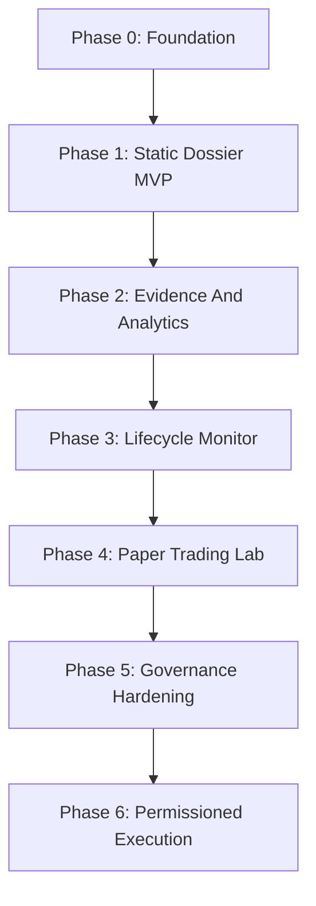

# Parallax Phased Implementation Plan

This plan turns the CBS-120 design into buildable phases.

The sequencing is deliberate:

1. prove the dossier loop;
2. add real evidence carefully;
3. make lifecycle monitoring real;
4. add paper trading and attribution;
5. add governance and model-risk infrastructure;
6. only then consider permissioned live execution.

## Phase Overview

| Phase | Name | Primary Goal | Action Ceiling |
|---:|---|---|---|
| 0 | Foundation | Set repo, schemas, fixtures, and test harness | none |
| 1 | Static Dossier MVP | Generate auditable dossiers from fixture data | watchlist |
| 2 | Evidence And Analytics | Add real data adapters and deterministic analytics | watchlist |
| 3 | Lifecycle Monitor | Add freshness, triggers, state transitions, and revalidation | watchlist |
| 4 | Paper Trading Lab | Add simulated orders, fill assumptions, and attribution | paper_trade_candidate |
| 5 | Governance Hardening | Add model registry, dashboards, calibration, and review workflows | paper_trade_candidate |
| 6 | Permissioned Execution | Add broker integration behind approvals and controls | order_ticket_candidate |

## Global Architecture Target

```text
User Request
  -> Intake
  -> Evidence Snapshot
  -> Deterministic Analytics
  -> Independent Council
  -> Cross-Examination
  -> Synthesis
  -> Decision Gate
  -> Lifecycle Assignment
  -> Audit Bundle
  -> Monitor/Revalidate
```

## Global Engineering Rules

- Deterministic tools own numeric outputs.
- LLM/persona outputs must validate against schemas.
- All important objects must be persisted and replayable.
- External text is untrusted.
- Hard vetoes must be enforced by services, not by prompt instruction.
- MVP and early phases must not include live broker execution.
- Stale or invalidated theses cannot be escalated.

## Phase 0: Foundation

Detailed plan: [phase_0_foundation.md](phases/phase_0_foundation.md)

Build the project skeleton, schemas, local fixture data, validation tooling, audit log shape, and test harness. This phase produces no financial analysis yet. It creates the rails that keep later work from becoming messy.

Exit criteria:

- repository skeleton exists;
- core schemas validate;
- fixture dataset exists;
- CI or local test command runs;
- no live data or broker integration exists.

## Phase 1: Static Dossier MVP

Detailed plan: [phase_1_static_dossier_mvp.md](phases/phase_1_static_dossier_mvp.md)

Build the first end-to-end analysis loop using fixture data and mocked deterministic tool outputs. The system should produce a complete Trade Thesis Dossier with council packets, synthesis, decision packet, lifecycle state, and audit bundle.

Exit criteria:

- one user thesis creates one full dossier;
- six MVP personas produce schema-valid claim packets;
- decision gate applies action ceiling and hard vetoes;
- final dossier includes bull case, bear case, dissent, invalidators, and next trigger;
- replay produces the same decision packet.

## Phase 2: Evidence And Analytics

Detailed plan: [phase_2_evidence_and_analytics.md](phases/phase_2_evidence_and_analytics.md)

Replace mocked tool outputs with real deterministic analytics and add limited real-world data adapters. Keep scope narrow: one initial asset class and a small set of analytics.

Exit criteria:

- evidence snapshots include provenance and freshness;
- analytics produce versioned tool outputs;
- stale/missing/conflicting data triggers downgrade or veto;
- numeric claims require tool references;
- action ceiling remains watchlist.

## Phase 3: Lifecycle Monitor

Detailed plan: [phase_3_lifecycle_monitor.md](phases/phase_3_lifecycle_monitor.md)

Make the "markets constantly change" answer operational. Add a market-state sentinel, freshness scoring, trigger evaluation, thesis state transitions, and revalidation scheduling.

Exit criteria:

- thesis state machine works;
- freshness score changes as evidence ages and market conditions drift;
- triggers cause observe, recheck, downgrade, invalidate, or escalate actions;
- stale and invalidated theses cannot be escalated;
- historical trigger replay tests pass.

## Phase 4: Paper Trading Lab

Detailed plan: [phase_4_paper_trading_lab.md](phases/phase_4_paper_trading_lab.md)

Allow the system to promote selected dossiers into simulated trades with explicit fill assumptions, risk budget reservation, and outcome attribution.

Exit criteria:

- paper-trade candidates create simulated order tickets;
- fills record assumptions and slippage model;
- attribution separates thesis quality, timing, sizing, execution, and market regime effects;
- paper results feed calibration dashboards but do not auto-change prompts or strategies.

## Phase 5: Governance Hardening

Detailed plan: [phase_5_governance_hardening.md](phases/phase_5_governance_hardening.md)

Add model-risk infrastructure, calibration reports, monitoring dashboards, review workflows, recordkeeping exports, and release controls.

Exit criteria:

- model and prompt registry exists;
- every production persona/tool has version and validation status;
- calibration and veto dashboards exist;
- audit exports are reviewable;
- release process blocks unvalidated persona/tool changes.

## Phase 6: Permissioned Execution

Detailed plan: [phase_6_permissioned_execution.md](phases/phase_6_permissioned_execution.md)

Add broker integration only as an approval-bound order-ticket workflow. The system may prepare an order-ticket candidate, but human approval, pre-trade controls, broker constraints, and kill switch remain mandatory.

Exit criteria:

- broker adapter is sandboxed/paper-first;
- order tickets require approval;
- pre-trade controls enforce risk, concentration, liquidity, and mandate limits;
- kill switch exists and is tested;
- post-trade review is mandatory;
- no API path can bypass approval.

## Suggested Build Order Inside Each Phase

1. Define schema.
2. Add fixtures.
3. Add deterministic service.
4. Add council or workflow integration.
5. Add persistence.
6. Add tests.
7. Add minimal UI/CLI path.
8. Add documentation.

## Recommended First Interface

Start with a CLI or local web console that accepts:

```text
parallax analyze --symbol NVDA --horizon swing --thesis "post-earnings continuation"
```

The interface should return:

- dossier markdown;
- decision packet JSON;
- audit bundle path;
- lifecycle state;
- next trigger.

## Phase Dependency Map



## Success Definition

The implementation is successful when Parallax can consistently produce dossiers that are:

- evidence-linked;
- numerically grounded;
- adversarially reviewed;
- vetoable;
- lifecycle-aware;
- replayable;
- useful enough to guide research and watchlist decisions without pretending to be an oracle.
